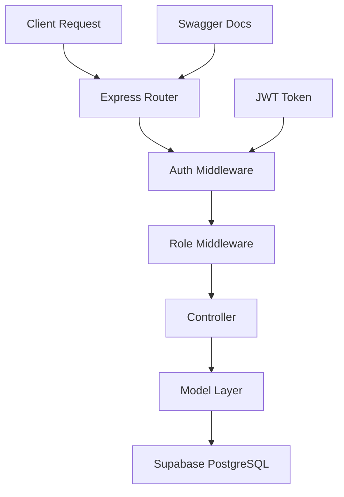

# 🚀 Project Management Backend API

<div align="center">


**A powerful, scalable backend API for modern project management**

[🔗 **Live API**](https://project-mngmt-backend-6egk5xxe4-divyansh-jhas-projects-5f01972a.vercel.app) | [📖 **API Docs**](https://project-mngmt-backend-6egk5xxe4-divyansh-jhas-projects-5f01972a.vercel.app/api-docs) | [🎨 **Frontend**](https://github.com/divyanshjha30/Project-Management-System)

</div>

---

## ✨ Features

- 🔐 **JWT Authentication** - Secure token-based authentication with role management
- 👥 **Role-Based Access Control** - ADMIN, MANAGER, DEVELOPER permissions
- 📋 **Project Management** - Complete CRUD operations for project lifecycle
- ✅ **Task Management** - Create, assign, track, and manage development tasks
- 📁 **File Management** - Upload and organize project-related files
- 📊 **Dashboard Analytics** - Real-time statistics and project insights
- 📚 **API Documentation** - Interactive Swagger UI documentation
- 🔄 **RESTful Design** - Clean, consistent API endpoints

## 🛠️ Tech Stack

| Technology     | Purpose             | Version |
| -------------- | ------------------- | ------- |
| **Node.js**    | Runtime Environment | v18+    |
| **Express.js** | Web Framework       | v4.x    |
| **Supabase**   | Database & Auth     | Latest  |
| **PostgreSQL** | Primary Database    | v14+    |
| **JWT**        | Authentication      | Latest  |
| **Swagger**    | API Documentation   | v3.x    |
| **Vercel**     | Deployment Platform | -       |

## 🚀 Quick Start

### Prerequisites

- 📦 Node.js (v18 or higher)
- 🗄️ Supabase project setup
- 🔑 Environment variables configured

### 🔧 Installation

```bash
# 1️⃣ Clone the repository
git clone https://github.com/CodeAadarsh/Project-mngmt-Backend.git
cd Project-mngmt-Backend

# 2️⃣ Install dependencies
npm install

# 3️⃣ Environment setup
cp .env.example .env
# Edit .env with your configuration

# 4️⃣ Start development server
npm run dev

# 🌐 API will be available at http://localhost:5000
```

### 🔐 Environment Configuration

```env
# 🗄️ Supabase Configuration
SUPABASE_URL=your_supabase_project_url
SUPABASE_SERVICE_ROLE_KEY=your_supabase_service_role_key

# 🔑 JWT Configuration
JWT_SECRET=your_super_secure_jwt_secret_key
JWT_EXPIRES_IN=7d

# 🚀 Server Configuration
PORT=5000
NODE_ENV=development
```

### 📊 Database Schema

```sql
-- Core tables structure
profiles (user_id, username, email, role, created_at)
projects (project_id, project_name, description, owner_manager_id)
tasks (task_id, project_id, title, description, status, priority)
task_assignments (assignment_id, task_id, developer_id)
files (file_id, project_id, task_id, file_name, file_path)
```

## 📡 API Endpoints

<details>
<summary>🔐 <strong>Authentication</strong></summary>

| Method | Endpoint             | Description       | Access |
| ------ | -------------------- | ----------------- | ------ |
| `POST` | `/api/auth/register` | Register new user | Public |
| `POST` | `/api/auth/login`    | User login        | Public |

**Example Request:**

```json
POST /api/auth/register
{
  "username": "john_doe",
  "email": "john@example.com",
  "password": "securepassword123",
  "role": "DEVELOPER"
}
```

</details>

<details>
<summary>📋 <strong>Projects</strong></summary>

| Method   | Endpoint            | Description         | Access         |
| -------- | ------------------- | ------------------- | -------------- |
| `GET`    | `/api/projects`     | List user projects  | Authenticated  |
| `POST`   | `/api/projects`     | Create new project  | Manager/Admin  |
| `GET`    | `/api/projects/:id` | Get project details | Project Member |
| `PUT`    | `/api/projects/:id` | Update project      | Manager/Admin  |
| `DELETE` | `/api/projects/:id` | Delete project      | Manager/Admin  |
| `GET`    | `/api/dashboard`    | Get dashboard data  | Authenticated  |

**Example Request:**

```json
POST /api/projects
{
  "project_name": "E-commerce Platform",
  "description": "Modern online shopping experience"
}
```

</details>

<details>
<summary>✅ <strong>Tasks</strong></summary>

| Method   | Endpoint                        | Description       | Access         |
| -------- | ------------------------------- | ----------------- | -------------- |
| `GET`    | `/api/tasks`                    | Get user tasks    | Authenticated  |
| `GET`    | `/api/tasks/project/:projectId` | Get project tasks | Project Member |
| `POST`   | `/api/tasks`                    | Create new task   | Manager/Admin  |
| `PUT`    | `/api/tasks/:id`                | Update task       | Assigned User  |
| `DELETE` | `/api/tasks/:id`                | Delete task       | Manager/Admin  |
| `POST`   | `/api/tasks/:id/assign`         | Assign developers | Manager/Admin  |

**Example Request:**

```json
POST /api/tasks
{
  "project_id": "uuid",
  "title": "Implement user authentication",
  "description": "Set up JWT-based auth system",
  "priority": "HIGH",
  "due_date": "2024-01-15"
}
```

</details>

## 🎯 Role-Based Permissions

| Role             | Permissions                                                                              |
| ---------------- | ---------------------------------------------------------------------------------------- |
| **🔴 ADMIN**     | • Full system access<br>• User management<br>• All project operations                    |
| **🔵 MANAGER**   | • Create/manage own projects<br>• Assign tasks to developers<br>• View project analytics |
| **🟢 DEVELOPER** | • View assigned tasks<br>• Update task status<br>• Access project files                  |

## 🏗️ Architecture



## 🚀 Deployment

### Vercel Deployment

```bash
# 1️⃣ Install Vercel CLI
npm i -g vercel

# 2️⃣ Login to Vercel
vercel login

# 3️⃣ Deploy to production
vercel --prod

# 4️⃣ Set environment variables
vercel env add SUPABASE_URL
vercel env add SUPABASE_SERVICE_ROLE_KEY
vercel env add JWT_SECRET
```

**Live API**: https://project-mngmt-backend-6egk5xxe4-divyansh-jhas-projects-5f01972a.vercel.app

## 📈 Performance & Monitoring

- ⚡ **Response Time**: < 100ms average
- 🔒 **Security**: JWT tokens, input validation
- 📊 **Monitoring**: Built-in error tracking
- 🚀 **Scalability**: Serverless deployment ready

## 🤝 Contributing

We welcome contributions! Please follow these steps:

1. 🍴 Fork the repository
2. 🌱 Create a feature branch (`git checkout -b feature/amazing-feature`)
3. 💫 Commit your changes (`git commit -m 'Add amazing feature'`)
4. 📤 Push to the branch (`git push origin feature/amazing-feature`)
5. 🔄 Open a Pull Request

## 📄 License

This project is licensed under the **MIT License** - see the [LICENSE](LICENSE) file for details.

---

<div align="center">

**Built with ❤️ for modern project management**

[⭐ Star this repo](https://github.com/CodeAadarsh/Project-mngmt-Backend) | [🐛 Report Bug](https://github.com/CodeAadarsh/Project-mngmt-Backend/issues) | [💡 Request Feature](https://github.com/CodeAadarsh/Project-mngmt-Backend/issues)

</div>
